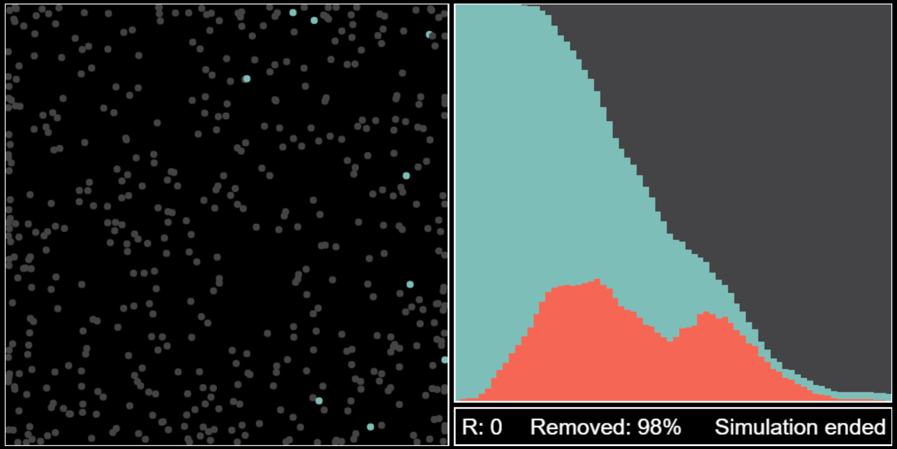

# Virus simulation

This project is about a virus simulator with great visualization. You can also highly customize the settings of the simulation. Note that the idea came from [3Blue1Brown's video](https://www.youtube.com/watch?v=gxAaO2rsdIs) on Youtube.
<br/><br/>


## Installation

First, **clone** the repository to your device.

```cmd
git clone https://github.com/mirusz9/Virus-Simulation.git
```
After cloning the repository, install the dependencies with the **Node Package Manager**, which comes with [node.js](https://nodejs.org/en/). Be aware that `npm install` installs the Dev-dependencies as well. If you don't need them, use `npm install --only=prod` instead.
```cmd
# Installs dev-dependencies as well
npm install

# Doesn't install dev-dependencies
npm install --only=prod
```
### Dependencies

These dependencies are required for the code to work.

* ejs
* express
* typescript

### Developement dependecies

These are for better code editing and faster testing

* @types/node
* nodemon
---
## Usage
### Npm scripts
The most important commands are preset by mirusz9. `npm start` just starts a webserver on port 3000. `npm run start-with-nodemon` does the same, but nodemon restarts the server every time a .js file is changed. Note that dev-dependencies are **required** to use this command. If you have changed some typescript files, you **must** first compile all the .ts files to .js. This can be done with `npm run ts-compile`.
```cmd
# Starts the webserver
npm start

# Starts the webserver with nodemon (dev-dependencies are required)
npm run start-with-nodemon

# Compiles the typescript files to javascript
npm run ts-compile
```


### Editing settings
The settings file is located here `./src/settings.ts`. A basic documentation is found in the settings file. Scroll down for detailed description.
```javascript
export default {
	fps: 30,
	popSize: 500,
	socialDistancing: 0,
	maxVel: 1,
	infectious: {
		range: 20,
		count: 1,
		probab: 0.05,
		duration: 5,
	},
};
```

Setting|Default value|Description
-|-|-
fps|30|Sets the refresh rate of the simulation. Note that the simulation is **optimized for 30fps**.
popSize|500|Sets how many cells are in the simulation. If you have a slower computer, a smaller population size is recommended.
socialDistancing|0|Sets how many cells out of the population size are trying to get as far as they can from others. This number cannot be bigger than the `popSize`.
maxVel|1|Limits the velocity of the cells. Given in pixels.
range|20|The radius an infected cell can sense others. If another cell is in the radius, there is some probability that the cell becomes infected.
count|1|Sets the number of infected cells at the start of the simulation
probab|0.05|The probability a cell gets infected if it is in the `radius` of an infected cell. This must be a number between 0 and 1.
duration|5|The duration a cell is infected before becoming removed. This number is **not** counted in frames but seconds. At 30 frames a second this means 150 frames.

After editing the settings, make sure to **save** the file and compile it into JavaScript. This can be done with `npm run ts-compile`.

### Running simulation
Before running the simulation, you need to start the server with `npm start`.
```cmd
npm start
```
After starting the server, open your browser and go to `http://localhost:3000/`. The simulation starts immediately. If you want to run the simulation again, just reload the page. After you change any of the settings or files, restart the server with running `npm start` again.
